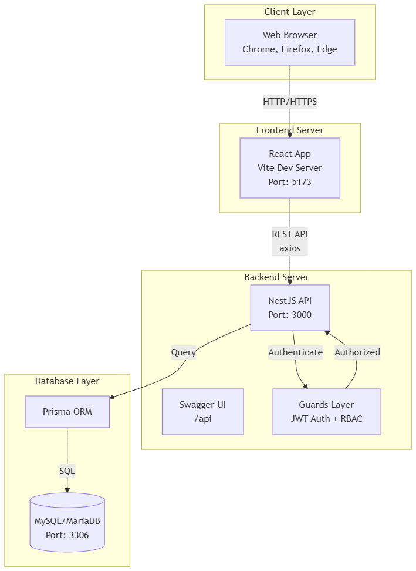
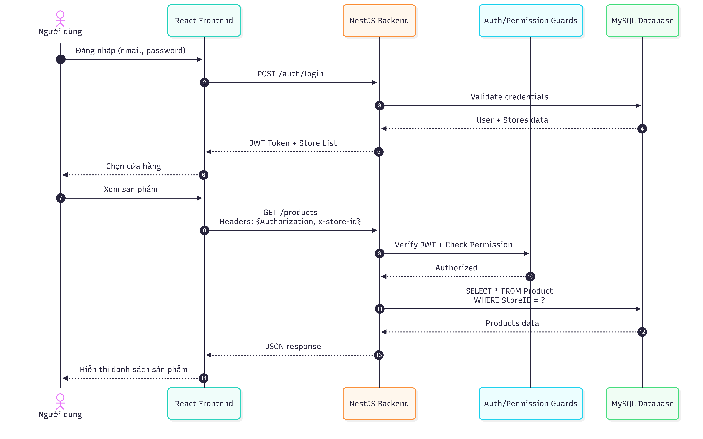
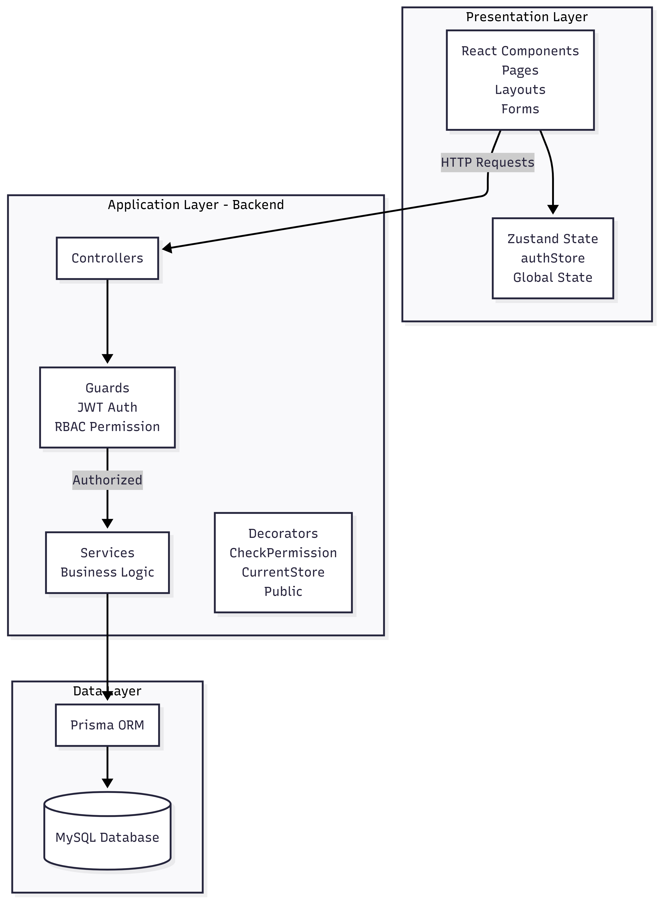
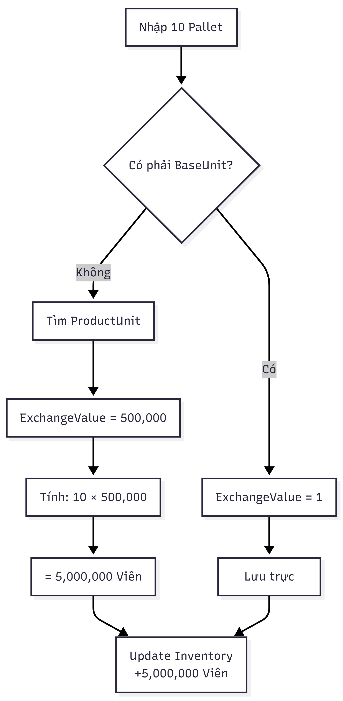
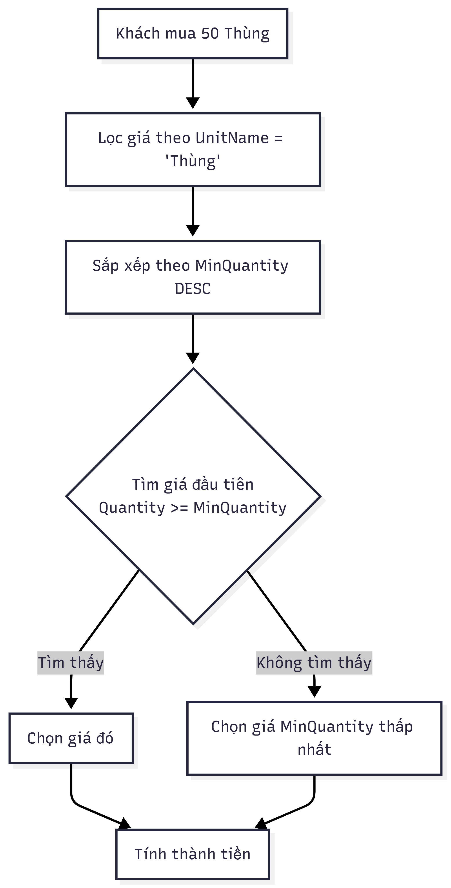
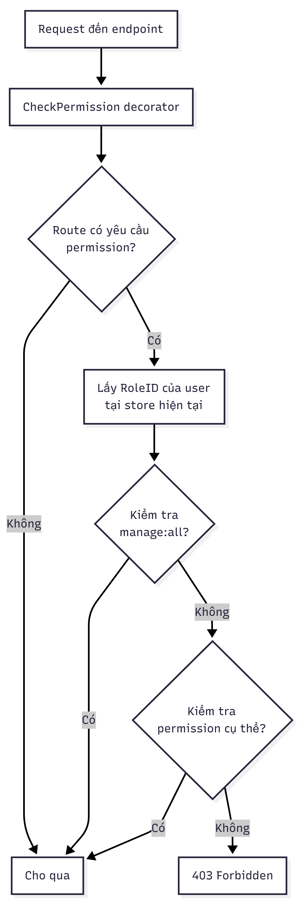
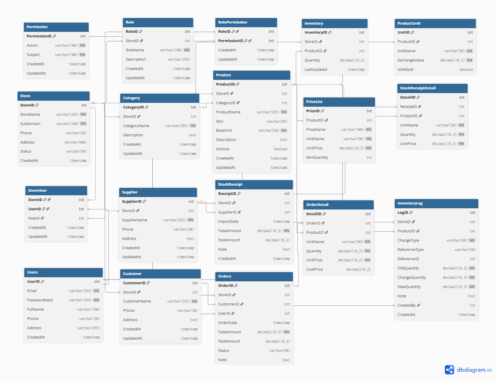
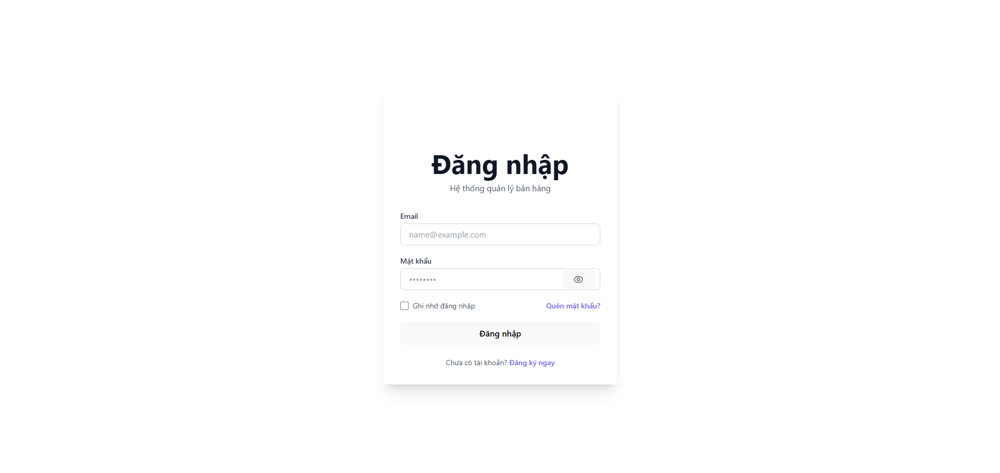

# MULTI-TENANT POS MANAGEMENT SYSTEM
> Hệ thống Quản lý Bán hàng Đa cửa hàng (Multi-Tenant Point of Sale System)

## GIỚI THIỆU

Đây là một **hệ thống quản lý bán hàng (POS) đa cửa hàng (Multi-Tenant)** được xây dựng đặc biệt cho các cửa hàng nhỏ lẻ tại Việt Nam. Hệ thống cung cấp giải pháp toàn diện cho việc quản lý:

### Tính năng chính

- **Multi-Tenant Architecture**: Một nền tảng phục vụ nhiều cửa hàng độc lập, dữ liệu được cách ly hoàn toàn
- **Quản lý sản phẩm**: Hỗ trợ nhiều đơn vị quy đổi (Pallet, Thùng, Viên, ...) và nhiều mức giá
- **Quản lý kho**: Nhập/xuất kho tự động với quy đổi đơn vị, theo dõi tồn kho real-time
- **Bán hàng**: Tạo đơn hàng với kiểm tra tồn kho tự động, áp giá linh hoạt
- **Quản lý khách hàng & Nhà cung cấp**: Theo dõi thông tin và công nợ
- **Báo cáo**: Doanh thu, lợi nhuận, sản phẩm bán chạy
- **Phân quyền RBAC**: Quản lý vai trò và quyền hạn chi tiết cho từng thành viên

### Vấn đề giải quyết

**Trước khi có hệ thống:**
- Quản lý tồn kho thủ công, dễ sai sót
- Không theo dõi được công nợ khách hàng/nhà cung cấp
- Không có báo cáo lợi nhuận, doanh thu chính xác
- Nhiều người dùng nhưng không phân quyền rõ ràng
- Mỗi cửa hàng một hệ thống riêng (tốn chi phí)

**Sau khi có hệ thống:**
- Một nền tảng phục vụ nhiều cửa hàng (tiết kiệm chi phí)
- Tự động cập nhật tồn kho khi nhập/xuất hàng
- Theo dõi công nợ real-time
- Báo cáo tự động doanh thu, lợi nhuận
- Phân quyền chi tiết cho từng nhân viên
- Dữ liệu độc lập giữa các cửa hàng

## TÁC GIẢ

**Bùi Quang Hưng** - 20225849  
**Trường**: Trường công nghệ thông tin và truyền thông, Đại học Bách Khoa Hà Nội  
**Môn học**: Nghiên cứu đồ án tốt nghiệp 2

## MÔI TRƯỜNG HOẠT ĐỘNG

### Thành phần Hệ thống

#### **Backend (API Server)**
- **Platform**: NestJS (Node.js Framework)
- **Language**: TypeScript
- **Database**: MySQL/MariaDB
- **ORM**: Prisma Client
- **Authentication**: JWT (JSON Web Token)
- **API Documentation**: Swagger/OpenAPI

#### **Frontend (Web Application)**
- **Framework**: React 18
- **Build Tool**: Vite 5
- **Language**: JavaScript (JSX)
- **State Management**: Zustand
- **Routing**: React Router v6
- **UI Framework**: Tailwind CSS 4
- **Form Handling**: React Hook Form
- **HTTP Client**: Axios

#### **Database**
- **Type**: MySQL 8.0+ / MariaDB 10.6+
- **Schema Management**: Prisma Migrations
- **Port**: 3306 (default)

### Nền tảng OS

Hệ thống hoạt động trên:
- **Windows** 10/11
- **macOS** 11+
- **Linux** (Ubuntu 20.04+, Debian, CentOS)

### Sơ đồ Tích hợp Hệ thống

<p align="center">
  
</p>

### Multi-Tenant Request Flow

<p align="center">
  
</p>

## HƯỚNG DẪN CÀI ĐẶT VÀ CHẠY THỬ

###  Yêu cầu

- **Node.js**: >= 18.0.0
- **npm** hoặc **yarn**
- **MySQL/MariaDB**: >= 8.0 / 10.6
- **Git**

### Bước 1: Clone Repository

```bash
git clone https://github.com/gnuhq26/GR2_HUST_2025.1.git
cd GR2_HUST_2025.1
```

### Bước 2: Cài đặt Database

1. Tạo database MySQL:
```sql
CREATE DATABASE pos_db CHARACTER SET utf8mb4 COLLATE utf8mb4_unicode_ci;
```

2. Tạo file `.env` trong thư mục `backend`:
```bash
cd backend
cp .env.example .env
```

3. Cấu hình file `.env`:
```env
# Database Configuration
DATABASE_HOST=localhost
DATABASE_USER=root
DATABASE_PASSWORD=your_password
DATABASE_NAME=pos_db

# JWT Configuration
JWT_SECRET=your-super-secret-jwt-key-change-this-in-production
JWT_EXPIRES_IN=7d

# Server Configuration
PORT=3000
```

### Bước 3: Cài đặt Backend

```bash
# Ở thư mục backend/
npm install

# Chạy Prisma migrations (tạo tables)
npx prisma migrate deploy

# (Optional) Seed dữ liệu mẫu
npx prisma db seed

# Khởi động server
npm run start:dev
```

**Kiểm tra:** Mở http://localhost:3000/api để xem Swagger API Documentation

### Bước 4: Cài đặt Frontend

```bash
# Mở terminal mới
cd frontend

# Cài đặt dependencies
npm install

# Khởi động dev server
npm run dev
```

**Kiểm tra:** Mở http://localhost:5173

### Bước 5: Self Test (Kiểm tra hoạt động)

#### Test Case 1: Đăng ký và Đăng nhập

1. Truy cập http://localhost:5173
2. Click **"Đăng ký"**
3. Nhập thông tin:
   - Email: `test@example.com`
   - Password: `123456`
   - Họ tên: `Nguyễn Văn A`
4. Click **"Đăng ký"** → Thành công, tự động chuyển đến trang tạo cửa hàng

#### Test Case 2: Tạo cửa hàng

1. Nhập thông tin cửa hàng:
   - Tên cửa hàng: `Cửa hàng Test`
   - Subdomain: `test` (URL: test.pos.com)
   - Số điện thoại: `0123456789`
2. Click **"Tạo cửa hàng"** → Chuyển đến Dashboard

#### Test Case 3: Tạo sản phẩm với Multi-Unit

1. Vào menu **"Sản phẩm"** → Click **"Thêm sản phẩm"**
2. Nhập:
   - Tên: `Gạch xây dựng`
   - SKU: `GACH-001`
   - Danh mục: `Vật liệu xây dựng`
   - Đơn vị gốc: `Viên`
3. Thêm đơn vị quy đổi:
   - Đơn vị: `Thùng`, Quy đổi: `1000` (1 Thùng = 1000 Viên)
   - Đơn vị: `Pallet`, Quy đổi: `500000` (1 Pallet = 500,000 Viên)
4. Thêm bảng giá:
   - Giá lẻ: `60đ/Viên`, Số lượng tối thiểu: `0`
   - Giá sỉ: `50,000đ/Thùng`, Số lượng tối thiểu: `10`
5. **Kết quả**: Sản phẩm được tạo, tồn kho tự động = 0

#### Test Case 4: Nhập kho

1. Vào menu **"Kho"** → Click **"Nhập kho"**
2. Chọn nhà cung cấp, thêm sản phẩm:
   - Sản phẩm: `Gạch xây dựng`
   - Đơn vị: `Pallet`
   - Số lượng: `10`
   - Đơn giá: `20,000,000đ`
3. Click **"Nhập kho"**
4. **Kết quả**: 
   - Tồn kho tăng: `10 Pallet × 500,000 = 5,000,000 Viên`
   - Hiển thị trong danh sách kho

#### Test Case 5: Bán hàng

1. Vào menu **"Đơn hàng"** → Click **"Tạo đơn hàng"**
2. Thêm sản phẩm:
   - Sản phẩm: `Gạch xây dựng`
   - Đơn vị: `Thùng`
   - Số lượng: `50`
3. **Kết quả**:
   - Giá tự động: `50,000đ/Thùng` (vì 50 >= MinQuantity 10)
   - Tổng tiền: `2,500,000đ`
   - Tồn kho giảm: `5,000,000 - 50,000 = 4,950,000 Viên`

#### Test Case 6: Phân quyền

1. Vào **"Cài đặt cửa hàng"** → **"Vai trò"**
2. Tạo vai trò mới: `Nhân viên bán hàng`
3. Gán quyền:
   - `read:Product`
   - `create:Order`
   - `read:Customer`
4. Vào **"Thành viên"** → Thêm thành viên với role này
5. Đăng nhập bằng tài khoản nhân viên
6. **Kết quả**: Chỉ thấy menu Sản phẩm, Đơn hàng, Khách hàng. Không thấy nút Thêm/Sửa/Xóa sản phẩm

## NGUYÊN LÝ CƠ BẢN

### TÍCH HỢP HỆ THỐNG

#### Kiến trúc 3-Layer

<p align="center">
  
</p>

#### Backend Modules (NestJS)

| Module | Chức năng | Endpoints |
|--------|-----------|-----------|
| **auth** | Đăng ký, Đăng nhập, JWT | `POST /auth/login`, `POST /auth/register` |
| **stores** | Quản lý cửa hàng, thành viên | `GET /stores`, `POST /stores`, `GET /stores/members` |
| **roles** | Quản lý vai trò, phân quyền | `GET /roles`, `POST /roles`, `PUT /roles/:id/permissions` |
| **permissions** | Danh sách quyền hạn | `GET /permissions` |
| **products** | Quản lý sản phẩm, đơn vị, giá | `GET /products`, `POST /products`, `PATCH /products/:id` |
| **categories** | Quản lý danh mục | `GET /categories`, `POST /categories` |
| **inventory** | Nhập kho, tồn kho | `POST /inventory/stock-in`, `GET /inventory` |
| **orders** | Tạo đơn hàng, bán hàng | `POST /orders`, `GET /orders`, `GET /orders/:id` |
| **customers** | Quản lý khách hàng | `GET /customers`, `POST /customers` |
| **suppliers** | Quản lý nhà cung cấp | `GET /suppliers`, `POST /suppliers` |
| **reports** | Báo cáo doanh thu, lợi nhuận | `GET /reports/revenue`, `GET /reports/profit` |
| **debts** | Quản lý công nợ | `GET /debts`, `POST /debts/payment` |

#### Frontend Pages (React)

| Page | Route | Chức năng |
|------|-------|-----------|
| Login | `/login` | Đăng nhập |
| Dashboard | `/` | Trang tổng quan |
| Products | `/products` | Quản lý sản phẩm |
| Categories | `/categories` | Quản lý danh mục |
| Inventory | `/inventory` | Quản lý kho |
| Orders | `/orders` | Quản lý đơn hàng |
| Customers | `/customers` | Quản lý khách hàng |
| Suppliers | `/suppliers` | Quản lý NCC |
| Reports | `/reports` | Báo cáo |
| Store Settings | `/store/settings` | Cài đặt cửa hàng |
| Store Members | `/store/members` | Quản lý thành viên |
| Roles | `/store/roles` | Quản lý vai trò |

### CÁC THUẬT TOÁN CƠ BẢN

#### 1. JWT Authentication

**Thuật toán**: HMAC-SHA256

```typescript
const payload = {
  sub: user.UserID,           
  email: user.Email,
  stores: [                   
    {
      storeId: 1,
      storeName: "Cửa hàng A",
      subdomain: "abc",
      roleId: 3,
      roleName: "Manager"
    }
  ]
};

const token = jwt.sign(payload, JWT_SECRET, { expiresIn: '7d' });
```

**Verify Token:**
```typescript
const decoded = jwt.verify(token, JWT_SECRET);
request.user = decoded; 
```

#### 2. Password Hashing

**Thuật toán**: bcrypt (với salt rounds = 10)

```typescript
const salt = await bcrypt.genSalt(10);
const passwordHash = await bcrypt.hash(plainPassword, salt);

const isMatch = await bcrypt.compare(plainPassword, passwordHash);
if (!isMatch) throw UnauthorizedException;
```

#### 3. Multi-Unit Conversion

**Công thức quy đổi:**
```
Quantity in BaseUnit = Quantity × ExchangeValue
```

**Flow Chart:**

<p align="center">
  
</p>

**Code Implementation:**
```typescript
let exchangeValue = 1; 

if (item.unitName !== product.BaseUnit) {
  const productUnit = await prisma.productUnit.findFirst({
    where: { ProductID: item.productId, UnitName: item.unitName }
  });
  
  if (!productUnit) {
    throw BadRequestException("Unit not found");
  }
  
  exchangeValue = Number(productUnit.ExchangeValue);
}

const quantityInBaseUnit = item.quantity × exchangeValue;

await prisma.inventory.update({
  where: { StoreID_ProductID: { StoreID, ProductID } },
  data: { Quantity: { increment: quantityInBaseUnit } }
});
```

#### 4. Dynamic Price Selection

**Thuật toán chọn giá:**

<p align="center">
  
</p>

**Code:**
```typescript
const matchingPrices = product.prices.filter(
  p => p.UnitName === item.UnitName
);

const sortedPrices = matchingPrices.sort(
  (a, b) => b.MinQuantity - a.MinQuantity
);

let unitPrice = 0;
for (const price of sortedPrices) {
  if (item.Quantity >= price.MinQuantity) {
    unitPrice = price.UnitPrice;
    break;
  }
}

if (unitPrice === 0) {
  unitPrice = sortedPrices[sortedPrices.length - 1].UnitPrice;
}
```

#### 5. RBAC Permission Check

**Thuật toán:**

<p align="center">
  
</p>

**Code:**
```typescript
async checkPermission(roleId: number, action: string, subject: string) {
  const superAdmin = await prisma.rolePermission.findFirst({
    where: {
      RoleID: roleId,
      permission: { Action: 'manage', Subject: 'all' }
    }
  });
  
  if (superAdmin) return true; 
  
  const permission = await prisma.rolePermission.findFirst({
    where: {
      RoleID: roleId,
      permission: { Action: action, Subject: subject }
    }
  });
  
  return !!permission;
}
```


### THIẾT KẾ CƠ SỞ DỮ LIỆU

#### Database Schema (14 Tables)

<p align="center">
  
</p>

#### Các Table quan trọng

**1. Store (Cửa hàng)**
- `StoreID`: Primary Key
- `Subdomain`: Unique - định danh cửa hàng (abc.pos.com)
- `Status`: Active/Inactive
- **Vai trò**: Gốc của multi-tenant, tất cả data phải có StoreID

**2. StoreUser (Thành viên cửa hàng)**
- Composite PK: `(StoreID, UserID)`
- **Vai trò**: Liên kết Many-to-Many giữa User và Store
- User có thể tham gia nhiều Store với Role khác nhau

**3. RolePermission (Phân quyền)**
- Composite PK: `(RoleID, PermissionID)`
- **Vai trò**: Gán permissions cho role
- Ví dụ: Role "Manager" có permissions: `create:Product`, `read:Order`

**4. Product (Sản phẩm)**
- `BaseUnit`: Đơn vị gốc để lưu tồn kho (Viên, Kg, Lít, ...)
- **Unique**: `(StoreID, SKU)` - SKU không trùng trong cùng store
- **Quan hệ**: 1 Product → N ProductUnits, N PriceLists

**5. ProductUnit (Đơn vị quy đổi)**
- `ExchangeValue`: Tỷ lệ quy đổi về BaseUnit
- Ví dụ: `{ UnitName: "Thùng", ExchangeValue: 1000 }` → 1 Thùng = 1000 BaseUnit

**6. PriceList (Bảng giá)**
- `UnitName`: Giá theo đơn vị nào
- `MinQuantity`: Số lượng tối thiểu để áp giá này
- **Logic**: Mua càng nhiều (>= MinQuantity) → Giá càng rẻ

**7. Inventory (Tồn kho)**
- `Quantity`: Luôn lưu theo `BaseUnit`
- **Unique**: `(StoreID, ProductID)` - 1 sản phẩm 1 dòng tồn kho
- **Auto-update**: Khi nhập/xuất kho

**8. OrderDetail (Chi tiết đơn hàng)**
- `UnitPrice`: Giá bán thực tế
- `CostPrice`: Giá vốn (snapshot tại thời điểm bán)
- **Vai trò**: Tính lợi nhuận = `(UnitPrice - CostPrice) × Quantity`

#### File cấu hình `.env`

```bash
# Database Configuration
DATABASE_HOST=localhost          
DATABASE_USER=root             
DATABASE_PASSWORD=your_password 
DATABASE_NAME=pos_db           

# JWT Configuration
JWT_SECRET=your-super-secret-jwt-key-change-this
JWT_EXPIRES_IN=7d              

# Server Configuration
PORT=3000                      
NODE_ENV=development           
```


## KẾT QUẢ

### Screenshots

#### 1. Trang đăng nhập
<p align="center">
  
</p>

#### 2. Quản lý sản phẩm với Multi-Unit

*Danh sách sản phẩm với các đơn vị quy đổi*

#### 4. Form tạo sản phẩm

*Modal tạo sản phẩm mới với units và prices*

#### 5. Nhập kho

*Phiếu nhập kho với tự động quy đổi đơn vị*

#### 6. Tạo đơn hàng

*Form tạo đơn hàng với auto-select giá*

#### 7. Báo cáo doanh thu

*Biểu đồ doanh thu và lợi nhuận theo thời gian*

#### 8. Phân quyền RBAC

*Giao diện phân quyền với Permission Grid*


## TÀI LIỆU THAM KHẢO

- [NestJS Documentation](https://docs.nestjs.com/)
- [Prisma ORM](https://www.prisma.io/docs)
- [React Router v6](https://reactrouter.com/en/main)
- [Zustand State Management](https://zustand-demo.pmnd.rs/)
- [Tailwind CSS](https://tailwindcss.com/docs)
- [JWT Best Practices](https://jwt.io/introduction)
- [RBAC Design Patterns](https://en.wikipedia.org/wiki/Role-based_access_control)

## LICENSE

MIT License - Copyright (c) 2026 Bùi Quang Hưng

---

**📧 Liên hệ**: hung.bq225849@sis.hust.edu.vn  
**🔗 Repository**: https://github.com/gnuhq26/GR2_HUST_2025.1  
**📅 Last Updated**: January 20, 2026
